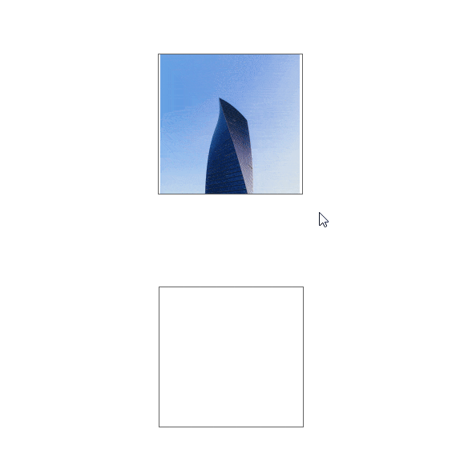
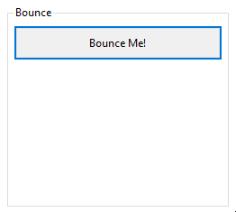
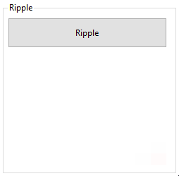
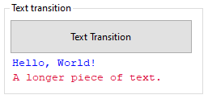

# FluentTransitions

[](https://www.nuget.org/packages/FluentTransitions/)

FluentTransitions lets you create animated transitions of any property of user-interface elements in .NET. It provides a simple API to perform UI animations in a similar way to Apple's Core Animation library for iOS, iPadOS and macOS.



<sup>FluentTransitions powering [FluentDragDrop](https://github.com/awaescher/FluentDragDrop), a library to create stunning drag and drop effects with Windows Forms.</sup>

## What can it do for me?

FluentTransitions allows smooth UI transitions with Windows Forms and GDI+. While the animation above shows several effects in combination, you will probably start with simpler things like the transition of a property of a Windows Forms control:

```csharp
var maxTop = button1.Parent.Height - button1.Height;

Transition
    .With(button1, nameof(Top), maxTop)      // target, property, value
    .Bounce(TimeSpan.FromMilliseconds(500)); // method and duration
```



### Multi targeting

Transitions can manipulate multiple properties from one or multiple objects simultaneously just by chaining the `.With()` methods:

```csharp
Transition
    .With(button1, nameof(Left), 300)
    .With(button2, nameof(Top), 200)
    .With(Form1, nameof(Opacity), 0.0)
    .EaseInEaseOut(TimeSpan.FromSeconds(2));
```

This code animates the movement of two buttons while it fades out the whole form. All of this is running in parallel within two seconds.

### Chaining

Some effects might require multiple transitions to be executed sequentially. FluentTransitions provides a concept called "Chaining". To use it, simply build your transitions and run them with `Transition.RunChain(...)`:

```csharp
Transition.RunChain
(
    Transition
        .With(button1, nameof(Left), 300)
        .With(button2, nameof(Top), 200)
        .Build(new Linear(TimeSpan.FromSeconds(1))),
    Transition
        .With(Form1, nameof(Opacity), 0.0)
        .Build(new Linear(TimeSpan.FromSeconds(1)))
);
```

This code animates the movement of two buttons first. Once this is done, it fades out the whole form. Both transitions are completed within two seconds.

### Completion

Each transition raises an event once it is completed. This can be useful to run code after the UI is done with animating.

```csharp
var t1 = Transition
    .With(button1, nameof(Left), 300)
    .With(button2, nameof(Top), 200)
    .Build(new EaseInEaseOut(500));
    
t1.TransitionCompletedEvent += (sender, args) => this.Close();
    
Transition.Run(t1);
```

> Prefer `Transition.RunChain()` to run animations after a prior animation did complete:

# More Samples

Back in the year 2011, I used these transitions to spice up two login forms for a customer project. Be kind to me, I was young and just wanted to make something fancy. Nevertheless, I think it's pretty special to WinForms.


But FluentTransitinons is more that just smoothly moving and sizing controls, you can do pretty much everything if you're creative enough.





## Acknowledgements

Idea and initial implementation by [Richard S. Shepherd on Google Code](https://code.google.com/p/dot-net-transitions/). The code was mirrored to GitHub by [Uwe Keim](https://github.com/UweKeim) to prevent it from disappearing as Google announced the shut down of Google Code.

2020-10-07 [Andreas Wäscher](https://github.com/awaescher)
- Migrated to .NET Core 3.1 and .NET Framework 4.8
- Updated namespaces, class names and the code itself to meet modern code standards
- Added fluent syntax to build and run transitions
- Switched from "dot-net-transitions" to "FluentTransitions"

2020-04-20 [zhenyuan0502](https://github.com/zhenyuan0502)
- Migrated to .NET Core 3.0

2015-07-16 [Uwe Keim](https://github.com/UweKeim)
- Copied this repository from [Google Code](https://code.google.com/p/dot-net-transitions/) to save it from disappearing when Google Code shuts down.

&copy; 2009 Richard S. Shepherd.
Thanks to Maxim Gready for writing the critical-damping transition method.
